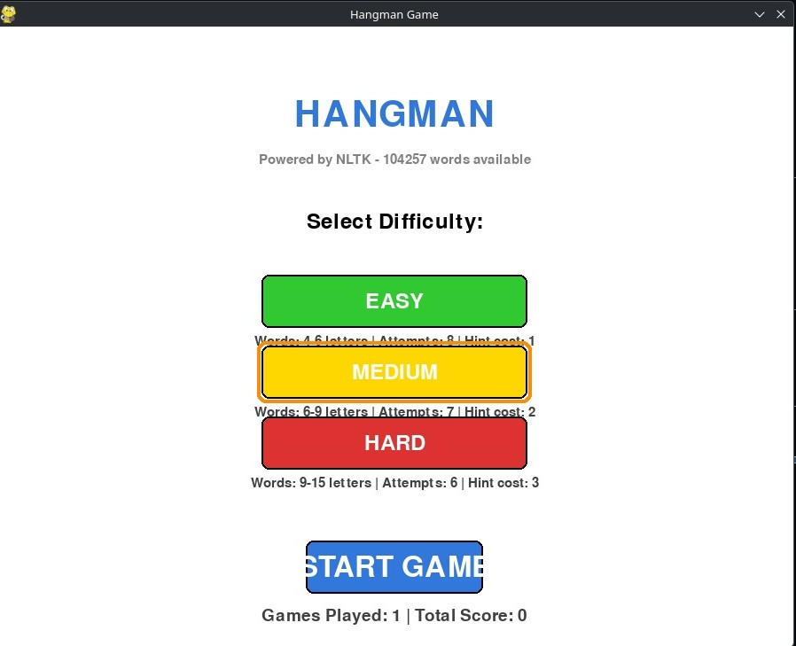

````
md
# 🎮 Pygame Hangman


A **graphical Hangman game** built with **Python + Pygame**, featuring **difficulty levels**, a **hint system**, and **scoring**.  
Uses the **NLTK `words` corpus** for a large dictionary when available, with a built-in fallback word list.

---

## 📌 Overview

Pygame Hangman is designed as both:
- a **playable desktop game**, and
- a **learning project** demonstrating clean game logic separation, testing, and packaging.

The core logic can run **without Pygame**, making it easy to test and extend.

---

## ✨ Features

- 🧩 **Three difficulty levels**
  - Adjusts word length, allowed attempts, and scoring
- 💡 **Hint system**
  - Reveals random letters
  - Limited to **3 hints per game**
  - Each hint reduces final score
- 🏁 **Dynamic scoring**
  - Based on remaining attempts and difficulty multiplier
- 📚 **Large dictionary support**
  - Uses NLTK `words` corpus if installed
  - Automatically falls back to bundled words if not
- 🧪 **Testable game logic**
  - Core mechanics run headless (no GUI required)

---

## 🚀 Quick Start

### 1) Install requirements

Pygame is required for the graphical interface:

```bash
pip install pygame
````

Optional but recommended (for a larger word list):

```bash
pip install nltk
python - <<'PY'
import nltk
nltk.download('words')
PY
```

---

### 2) Run the game

```bash
python hangman.py
```

---

## 🎮 Gameplay

* Guess letters to uncover the hidden word
* Incorrect guesses reduce remaining attempts
* Use hints sparingly — they cost points
* Win by guessing the word before attempts run out

Difficulty selection affects:

* Word length
* Number of attempts
* Score multiplier

---

## 🧪 Testing

The game logic is independent of the Pygame UI.

This allows:

* Headless testing
* Easier debugging
* Cleaner separation of concerns

Build the zipapp for testing or distribution:

```bash
python build_pyz.py
```

Output:

```text
dist/hangman.pyz
```

Run it with:

```bash
python dist/hangman.pyz
```

---

## 📦 Distribution

### Zipapp (single-file build)

This project supports building a Python zipapp, useful when tools like PyInstaller are unavailable.

```bash
python build_pyz.py
```

Run with:

```bash
python dist/hangman.pyz
```

---

## 🏷️ Release Packaging

Create a versioned release archive:

```bash
python publish_release.py v1.1.0
```

This generates:

* `releases/hangman-v1.1.0.zip`
* `releases/hangman-v1.1.0.zip.sha256`

Safety features:

* Refuses to run with uncommitted changes (unless `--allow-dirty` is used)
* Supports publishing a specific git ref with `--ref`
* Custom output directories supported via `--output-dir`

---

## 🧑‍💻 Development Setup

Install optional development tools:

```bash
pip install -r requirements-dev.txt
```

Recommended uses:

* Linting
* Release automation
* Testing helpers

---

## 📂 Project Structure (Simplified)

```text
.
├── hangman.py
├── build_pyz.py
├── publish_release.py
├── requirements-dev.txt
├── tests/
├── dist/
├── releases/
└── README.md
```

---

## 📸 Screenshots

To enhance the GitHub homepage, add screenshots or GIFs:

```md

```

---

## 📄 License

Check the repository for license details.

---

## 👤 Author

Zak
[https://github.com/zak213934-a11y](https://github.com/zak213934-a11y)

---

## ⭐ Support

If you find this project useful:

* Star the repository
* Fork it
* Experiment and build on top of it

---

Happy hacking 🎉

```

---

If you want next steps, I can:
- Add **release badges** automatically linked to GitHub Releases  
- Create a **matching banner image** for the repo  
- Rewrite this for a **more “professional” or more “fun” tone**  
- Generate a **CONTRIBUTING.md** to match the README  

Just tell me which direction you want to take it.
```
